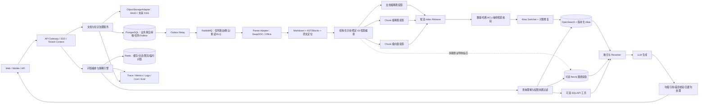

# 企业级可信多模态 RAG 知识库功能报告

> 版本：V1.6
> 日期：2026-08-27
> 定位：面向企业内部知识检索、可信问答与知识治理的一体化产品方案
> 状态：叙述层方案；最新实施状态以 [PROJECT_STATE.md](PROJECT_STATE.md)、ADR 与 Probe Decision Gate 为准

## 1. 执行摘要

本项目不应只被定义为“能上传文档并聊天的知识库”，而应定位为一套**权限安全、证据可追溯、质量可度量、故障可降级的企业知识基础设施**。

建议形成四项核心差异化：

1. **可信回答**：对回答中的事实性陈述做句级引用、证据对齐、无据句检测和拒答控制，让幻觉从不可见问题变为可测、可告警、可阻断的问题。
2. **复杂文档理解**：支持扫描件、双栏、图片、表格、跨页结构以及音视频，保留页码、版面坐标、时间戳等原始定位信息，确保答案可以跳回原文。
3. **企业治理**：把租户、组织、文档权限、审核、版本、有效期、敏感信息和审计日志贯穿采集、索引、检索、生成、引用全链路。
4. **RAG 工程化**：通过混合检索、重排、模型路由、熔断降级、质量黄金集、CI 门禁和在线反馈闭环，使效果、性能、成本能够持续运营。

建议首期交付“范围受控的企业级基础 MVP”，而不是向量检索 Demo：文档治理、不可变版本、异步入库、索引发布、混合检索、句级引用、权限前置过滤、审计、质量门禁和故障恢复都属于基座。知识图谱、长期记忆、全量音视频和复杂 Agent 工作流按真实业务场景分阶段启用，但其接入边界需要在 MVP 中稳定下来。

## 2. 报告依据与事实边界

本报告综合了以下材料：

- 七份本地 PDF 的逐页文本内容，包括文档生命周期、异步消息队列、双层全文/向量索引、多格式解析、PG + MongoDB 分层、多模态处理、混合检索、知识图谱、权限和观测方案。[S1][S2][S12-S16]
- 用户提供的目标实现摘要，包括 DeepDOC、128 token 分块、混合检索、句级引用、quick_parse、降级链及评测数据。
- 用户指定的 ragent 与 RAGFlow 官方仓库，作为后续选型和实现核验入口。[S3][S4]
- GraphRAG、Ragas、NIST、OWASP、PostgreSQL、MongoDB 等官方资料，作为架构与治理参考。[S5-S11]

需要特别说明：

- `Recall@5 0.92`、`引用覆盖率 0.96`、`忠实度 0.95`、`P50 1.2s` 和“17,614 行”等数字来自用户提供的项目摘要，本次未获得原始测试集、计算脚本和运行环境，因此应视为**候选基线/目标值，而非已审计验收结果**。
- 两个仓库已经在当前工作区完成拉取，并按固定 commit 做了源码核验：ragent 为 `16984b95454d3fc2a55b60ade1950fefeba339ec`，RAGFlow 为 `618c4599b10e792a5eaf3dee9c1cbe7c741c4803`。下文涉及“已实现”的竞品能力均限定在这两个快照和列出的源码范围内，不代表上游仓库当前主分支的全部能力。
- “制度性消灭幻觉”适合作为愿景，不适合作为绝对承诺。更准确的产品表达是：**制度性降低、发现、标记和阻断无依据回答**。

### 2.1 源码核验范围与结论

本节把“用户目标摘要”“PDF 设计”和“仓库当前实现”分开，避免把目标能力误写成已经交付的能力。

| 能力 | ragent 固定快照 | RAGFlow 固定快照 | 对本项目的结论 |
|---|---|---|---|
| 混合检索与预算 | `MultiChannelRetrievalEngine` 并行通道，`FusionPostProcessor` 加权 RRF，`RerankPostProcessor` 精排，`RetrievalBudget` 明确召回/候选池/上下文三段预算 | `rag/nlp/search.py` 支持关键词 + 向量融合，默认 `topk=1024`，BM25 `min_match=0.3`，无结果回退 `0.1` | 组合两者的工程经验；1024→5 只能作为可配置实验档位 |
| 证据闸门 | `EvidenceGatePostProcessor` 可按最高 rerank 分数对整批证据做闸门 | 检索结果可进入引用和多种 RAG 流程，但本次未将其等同于 ragent 的整批证据闸门 | 需要把相关性闸门、无据句检测和拒答作为统一策略层 |
| 引用 | `CitationContextEnricher` 生成前注入 `ref`，`CitationMarkup` 处理行内标记，`SourcesAssembler`/`GroundingChunksAssembler` 装配来源 | `insert_citations` 按句切分，使用 token similarity + vector similarity，阈值从 0.63 逐步降到 0.3；另有 citation prompt/二次补全 | 采用“生成约束 + 生成后回填 + 正确性校验”的双保险，不宣称 ragent 已有 RAGFlow 同款回填 |
| 复杂文档 | 当前重点是可编排入库 Pipeline，未以本次核验结果证明其具备 RAGFlow 同等级 DeepDOC | `pdf_parser.py`、`layout_recognizer.py`、`ocr.py`、`table_structure_recognizer.py` 直接覆盖版面、OCR、表格和页级定位 | DeepDOC 以 RAGFlow 为实现参考，正式复用前仍需做许可证、模型和性能核验 |
| Agent/图谱/知识编译 | README 和模块包含图谱检索、联网搜索、模型路由及记忆等工程能力 | `graphrag/`、`advanced_rag/agentic_rag.py`、`raptor.py`、MCP/连接器/可视化流程能力更完整 | GraphRAG、RAPTOR、Agentic RAG 放在 P1/P2，按黄金题证明增益后启用 |
| 容错与可观测 | 多通道超时降级、模型 CLOSED/OPEN/HALF_OPEN 健康状态、流式首包探测、Trace 和 Eval API | benchmark CLI 已覆盖 chat/retrieval latency、TTFT、成功率、QPS 等 | 两者可作为生产基线，但还不能据此证明用户给出的质量指标 |
| 异步消息 | 文档分块和知识库资源清理由 RocketMQ 消费者异步执行，并包含幂等和事务消息基础设施 | 当前快照提供消息队列抽象，默认 `ingestor.mq_type=nats`，同时存在 Redis/RabbitMQ 等配置与管理能力 | 本项目不照搬具体实现，采用 PostgreSQL Outbox + RabbitMQ，并保留版本化消息契约和幂等消费者 |
| 企业权限 | `UserContextInterceptor` 建立登录上下文；`SaTokenStpInterfaceImpl.getPermissionList()` 当前返回空列表，源码证据不足以证明完整 RBAC/ABAC | 有 tenant/dataset 作用域和租户派生索引线索，但不等同于部门、岗位、密级和文档 ACL 全链路 | 权限前置过滤、ACL 同步和审计必须作为本项目新增 P0，不可标记为竞品已完整解决 |
| quick_parse | 本次源码核验未找到确定的 `quick_parse` 实现 | 本次源码核验未找到确定的 `quick_parse` 实现 | 这是用户目标方案/产品设计，需单独实现和验收，不能写成仓库现成功能 |

源码证据入口：

- [ragent 固定快照](https://github.com/nageoffer/ragent/tree/16984b95454d3fc2a55b60ade1950fefeba339ec)
- [RAGFlow 固定快照](https://github.com/infiniflow/ragflow/tree/618c4599b10e792a5eaf3dee9c1cbe7c741c4803)
- ragent 关键文件：[检索编排](https://github.com/nageoffer/ragent/blob/16984b95454d3fc2a55b60ade1950fefeba339ec/rag/src/main/java/com/nageoffer/ai/ragent/rag/core/retrieval/MultiChannelRetrievalEngine.java)、[融合](https://github.com/nageoffer/ragent/blob/16984b95454d3fc2a55b60ade1950fefeba339ec/rag/src/main/java/com/nageoffer/ai/ragent/rag/core/retrieval/postprocessor/FusionPostProcessor.java)、[证据闸门](https://github.com/nageoffer/ragent/blob/16984b95454d3fc2a55b60ade1950fefeba339ec/rag/src/main/java/com/nageoffer/ai/ragent/rag/core/retrieval/postprocessor/EvidenceGatePostProcessor.java)、[引用上下文](https://github.com/nageoffer/ragent/blob/16984b95454d3fc2a55b60ade1950fefeba339ec/rag/src/main/java/com/nageoffer/ai/ragent/rag/core/source/CitationContextEnricher.java)、[模型健康状态](https://github.com/nageoffer/ragent/blob/16984b95454d3fc2a55b60ade1950fefeba339ec/infra-ai/src/main/java/com/nageoffer/ai/ragent/infra/model/ModelHealthStore.java)、[评测接口](https://github.com/nageoffer/ragent/blob/16984b95454d3fc2a55b60ade1950fefeba339ec/rag/src/main/java/com/nageoffer/ai/ragent/rag/eval/EvalController.java)、[权限实现](https://github.com/nageoffer/ragent/blob/16984b95454d3fc2a55b60ade1950fefeba339ec/system/src/main/java/com/nageoffer/ai/ragent/user/config/SaTokenStpInterfaceImpl.java)。
- RAGFlow 关键文件：[混合检索与引用回填](https://github.com/infiniflow/ragflow/blob/618c4599b10e792a5eaf3dee9c1cbe7c741c4803/rag/nlp/search.py)、[PDF/DeepDOC 解析](https://github.com/infiniflow/ragflow/blob/618c4599b10e792a5eaf3dee9c1cbe7c741c4803/deepdoc/parser/pdf_parser.py)、[版面识别](https://github.com/infiniflow/ragflow/blob/618c4599b10e792a5eaf3dee9c1cbe7c741c4803/deepdoc/vision/layout_recognizer.py)、[表格结构识别](https://github.com/infiniflow/ragflow/blob/618c4599b10e792a5eaf3dee9c1cbe7c741c4803/deepdoc/vision/table_structure_recognizer.py)、[对话引用调用](https://github.com/infiniflow/ragflow/blob/618c4599b10e792a5eaf3dee9c1cbe7c741c4803/api/db/services/dialog_service.py)、[benchmark 指标](https://github.com/infiniflow/ragflow/blob/618c4599b10e792a5eaf3dee9c1cbe7c741c4803/test/benchmark/metrics.py)。

## 3. 产品定位

### 3.1 目标用户

| 用户 | 核心任务 | 主要痛点 |
|---|---|---|
| 普通员工 | 查制度、找资料、解决业务问题 | 文档分散、关键词搜不到、答案无法核实 |
| 业务专家 | 沉淀经验、审核知识、纠正答案 | 知识更新慢、错误内容污染知识库 |
| 知识管理员 | 管理知识空间、文档生命周期和质量 | 缺少版本、审核、失效和质量治理 |
| 安全/合规管理员 | 管理权限、敏感数据和审计 | 越权检索、数据泄露、模型输出不可追责 |
| 研发/运维 | 集成业务系统、运营模型与检索链路 | 效果不可测、成本不可控、故障难定位 |

### 3.2 核心业务目标

- 将“找文档”升级为“获得可核验的业务结论”。
- 降低重复咨询、资料查找和新人培训时间。
- 把分散文档转化为有权限、有版本、有来源、有有效期的知识资产。
- 建立可持续迭代的 RAG 评测与运营体系，而不是一次性的 Demo 效果。

### 3.3 产品边界

首期聚焦企业内部知识问答和文档治理，不建议同时扩张为通用智能体平台、全功能 BI、流程自动化平台或主数据平台。Agent、图谱和结构化数据查询仅服务于“回答企业知识问题”这一主链路。

## 4. 产品功能全景

| 能力域 | 核心功能 | 优先级 |
|---|---|---|
| 租户与组织 | 多租户、部门/岗位、Keycloak OIDC、基础 RBAC/ACL、服务账号 | P0；企业 SSO/ABAC P1 |
| 知识空间 | 空间、目录、标签、负责人、可见范围、归档策略 | P0 |
| 文档治理 | 上传、审核、发布、驳回、版本、有效期、废止、回滚 | P0 |
| 内容接入 | 本地文件、对象存储适配、JSON/CSV 导入；网页/网盘/Wiki/API 连接器 | P0；连接器 P1 |
| 文档解析 | PDF/Office/Markdown、OCR、版面、表格、图片 | P0；音视频 P1 |
| 索引构建 | 结构化分块、稳定 ID、去重、增量索引、重建、血缘 | P0 |
| 检索 | BM25、向量、融合、重排、查询改写、权限过滤 | P0 |
| 可信问答 | 句级引用、证据回跳、无据句、拒答、答案反馈 | P0 |
| 临时问答 | quick_parse、会话级临时文件、自动过期 | P0 |
| Agentic RAG | 意图路由、问题拆解、迭代检索、工具调用 | P1 |
| 图谱/结构化检索 | 实体关系、GraphRAG、SQL/API 检索、证据融合 | P1/P2 |
| 多模态检索 | 文搜图、图搜图、视频时间点回跳、表格问答 | P1/P2 |
| 记忆与个性化 | 会话摘要、用户偏好、可查看/删除的长期记忆 | P1 |
| 评测运营 | 黄金集、离线评测、在线反馈、A/B、CI 门禁 | P0 |
| 可靠性 | Retry、熔断、降级、DLQ、幂等、任务重放、索引回滚 | P0；灾备/HPA P1 |
| 开放平台 | API、SDK、Webhook、模型/解析器/检索器插件 | P1 |

## 5. 详细功能设计

### 5.1 租户、组织与权限

#### 功能

- 租户、组织、部门、岗位、用户组、用户管理。
- OIDC/SAML/LDAP/企业微信/钉钉等统一身份接入。
- RBAC 管理页面、菜单和操作权限；ABAC 管理文档密级、部门、地域、项目、岗位、有效时间等数据权限。
- 文档、目录、知识空间三级授权，支持继承、覆盖和临时授权。
- 服务账号、API Key、最小权限、密钥轮换和调用审计。
- 管理员模拟权限与“为什么我能/不能看到该文档”的可解释诊断。

#### 关键约束

权限必须在候选召回阶段进入 OpenSearch 的关键词/向量 filter，不能在召回 Top-K 后才过滤。后过滤不仅可能让无权限内容进入模型上下文，还会使合法候选被提前挤出，造成召回率下降。

#### 对参考仓库现状的限定

ragent 的 `UserContextInterceptor` 能建立当前用户上下文，但本次固定快照中 `SaTokenStpInterfaceImpl.getPermissionList()` 直接返回空列表，且 `getRoleList()` 只读取用户角色。因此不能把它描述为已经完成企业级 RBAC/ABAC 或文档 ACL 全链路。RAGFlow 的 tenant/dataset 作用域和租户派生索引也不能自动等同于部门、岗位、密级、有效期等细粒度授权。目标系统必须把 ACL 条件编译到每路关键词、向量、图谱和工具检索，并对引用、预览、下载再次执行同一授权判断。

多租户隔离建议按风险分级：

- 高安全租户：独立索引、独立密钥，必要时独立集群。
- 标准租户：共享集群与索引模板，强制 `tenant_id + ACL` 过滤。
- 不建议无条件“每租户一个 OpenSearch 索引”。当租户数量很大、每租户数据很小时，会产生大量小索引和分片，增加集群元数据与运维成本。

#### 验收

- 跨租户、跨部门、越密级泄漏测试结果为 0。
- 权限变更后，搜索和问答链路在约定时限内生效。
- 检索、引用、原文预览、下载均执行相同授权策略。

### 5.2 知识空间与文档生命周期

新增审核 PDF 明确采用 `Draft、PendingReview、Published、Archived` 四态生命周期；驳回是从 PendingReview 返回 Draft 的动作，不是独立的长期状态。[S1][S14]

建议拆分多组正交状态，避免把业务发布、异步处理、索引发布和删除治理混在一个字段里：

1. **业务生命周期**：草稿 → 待审核 → 已发布 → 已归档；驳回是“待审核 → 草稿”的审核动作，不新增第五种状态。
2. **文件状态**：待校验、校验中、可用、隔离、拒绝、已删除。
3. **入库任务与步骤状态**：排队、运行、成功、部分成功、失败、取消；每个步骤单独记录尝试和错误。
4. **投影与索引发布状态**：构建、就绪、失效、移除，以及 Release 的校验、激活、取代、失败和中止。
5. **删除状态**：正常、软删除、待清除、清除中、已清除；Legal Hold 作为独立约束，不混入删除状态。
6. **问答运行状态**：运行状态、当前阶段和最终结果分开，避免未来 Agentic Retrieval 扩展状态大枚举。

四态审核状态本身已经足够；需要扩展的是周围的正交状态机，而不是继续给审核状态加值。建议至少增加文件安全、入库任务/步骤、投影、索引 Release、删除/Legal Hold、Outbox/DLQ、quick_parse 和问答 Run 状态。文档是否可检索必须由 `Published + 文件可用 + 未删除 + 有效期内 + 必需投影就绪 + 当前 Release 已激活 + ACL 通过` 派生，不能由接口直接写 `searchable=true`。完整枚举和迁移规则以[技术设计方案的正交状态模型](技术设计方案-TS企业级多模态RAG.md#72-正交状态模型)为准。

#### 功能

- 文档草稿、提交审核、通过、驳回、重新提交、撤回、废止。
- 多级审核、指定审核人、批量审核、审核 SLA 与提醒。
- 文档版本、版本差异、指定版本回滚、历史引用保留。
- 生效时间、失效时间、定期复审、过期提醒。
- 来源、负责人、权威等级、保密级别、业务域、标签和数据血缘。
- 软删除、恢复站、彻底删除审批、索引和缓存同步失效。
- 文档质量检查：空文档、乱码、重复内容、敏感信息、疑似广告/垃圾内容。

#### 索引规则

- Draft/PendingReview 版本可以在隔离的候选 Release 中预构建解析和索引，不能被线上检索访问。
- 只有已发布且对应候选 Release 校验通过的版本进入正式检索；发布时执行原子激活，而不是发布后才第一次开始索引。
- 新版本采用蓝绿索引或版本别名切换，成功后再替换旧版本；新版本未就绪或激活后 smoke check 失败时，旧版本继续服务或自动回滚。
- 已废止内容默认不参与回答，但历史会话仍能展示当时引用的不可变版本快照。

### 5.3 内容接入

#### 首期支持

- PDF、DOCX、XLSX、PPTX、TXT、Markdown、CSV、JSON。
- JPG、PNG 等图片。
- 网页 URL 抓取，保存来源地址、抓取时间、正文快照和内容哈希。
- 批量上传、断点续传、重复上传检测、失败重试。

#### 后续连接器

- SharePoint/OneDrive、Google Drive、Confluence、Notion、Git 仓库、企业网盘。
- 数据库、数据仓库、工单、CRM、客服系统和内部 API。
- 定时同步、增量同步、删除同步、权限同步和连接器健康监控。

#### 安全控制

- 文件类型白名单、大小限制、病毒/恶意文件扫描。
- 网页抓取防 SSRF、内网地址限制、跳转次数和下载大小限制。
- Prompt Injection 内容检测，将“文档中的指令”视为不可信数据，不允许其覆盖系统策略。
- PII/密钥/合同敏感字段检测与脱敏策略。

### 5.4 DeepDOC 复杂文档解析

用户提供的目标方案使用 `layout.onnx + OCR + tsr.onnx`，适合把复杂 PDF 解析作为核心竞争力。RAGFlow 官方仓库可作为 DeepDOC 方向的实现参考，但正式复用前需固定版本并核对许可证、模型、依赖与性能。[S4]

#### 解析流水线

1. 文件预检：格式、页数、加密、扫描件比例、语言、方向。
2. 版面分析：标题、正文、页眉页脚、脚注、列表、图片、表格、双栏区域。
3. 文本提取：原生文本优先，低质量页面回退 OCR。
4. 表格还原：识别行列、合并单元格、表头层级和跨页续表。
5. 阅读顺序恢复：处理双栏、浮动图片、脚注和跨页段落。
6. 标准化输出：Markdown/结构化 JSON + 原文页码 + bbox + 字符范围。
7. 质量评分：OCR 置信度、布局置信度、表格完整度、缺页与乱码告警。
8. 人工修订：低置信度页面进入校对台，修改结果保留版本和审计。

#### 多模态扩展

- 图片：OCR、图像描述、图表结构、视觉向量，支持文搜图和以图搜图。
- 音频：ASR、说话人分离、时间戳、关键词和章节切分。
- 视频：ASR + 场景切分 + 关键帧 + OCR + 内容摘要，引用可跳转到时间点。
- 表格：同时保留 Markdown、结构化单元格和原图；数值问题优先进入结构化计算，不只依赖文本生成。

#### 验收

- 扫描件、双栏、跨页表格分别建立专项测试集。
- 表格结构准确率、阅读顺序准确率、OCR 字符错误率分别度量，不能只检查“是否解析成功”。
- 每个可引用片段必须能回到原始页码、区域或音视频时间戳。

新增 PDF 对 Office 解析的补充纳入统一 Parser Adapter：DOCX/PPTX/XLSX 不只转换为扁平 Markdown，还要保留结构化块和来源定位。PPTX 至少保留 `slide_id`、`shape_id`、阅读顺序、图片/图表资产 ID；XLSX 保留 sheet、行列和合并单元格；DOCX 保留标题层级、段落和表格结构。解析失败或质量不足进入重试/DLQ，不静默发布。

### 5.5 分块、去重与索引构建

用户提供的“128 token 贪心分块 + xxhash 稳定 ID”适合追求细粒度引用和上传幂等，但不应成为所有文档的固定策略。

#### 推荐策略

- 默认采用布局/标题/段落/表格感知的结构化分块。
- 阶段 1 采用 PROBE-006 冻结的 `wide-1024`：`max_chars=1024`、`overlap_chars=128`、`rows_per_chunk=32`，按结构边界切分并保留稳定定位。
- 阶段 1 不建立 parent-child 索引。PROBE-006 的父子候选 Recall@5=0.6667，未优于 `wide-1024` 的 1.0，且索引估算体积更大；后续若重新引入，必须以新 Manifest、新索引 schema 和真实业务语料回归为依据。
- 表格、代码、FAQ、合同条款分别使用专用分块器。
- 保存 `tenant_id、knowledge_space_id、document_id、document_version_id、chunk_id、page、bbox、section_path、ACL、valid_time`。

#### 幂等与一致性

- 原文件使用 SHA-256 等强哈希作为内容身份；xxhash 可用于快速分块去重，但需要碰撞校验。
- `chunk_id` 由文档版本、结构路径、内容规范化结果确定性生成。
- 采用 Outbox/Event 机制驱动解析、向量化和 OpenSearch 写入，支持至少一次投递下的幂等消费。
- 每次索引任务记录解析器、Embedding、分块器、Reranker 和 Prompt 版本，支持重放和效果归因。

#### 文档级与块级双层索引

新增检索链路建议保留两类投影：文档级稀疏索引用于文档过滤、聚合和高层命中，块级向量/稀疏索引用于精确召回和引用。两者都使用 OpenSearch，不绑定新增 Elasticsearch；通过索引模板、版本化 alias 和 `document_version_id` 保持一致。最终证据必须落到 chunk、页码或结构化位置，文档级命中不能直接作为引用。

发布、更新、归档和删除使用带 `event_id` 的 Outbox 事件与 tombstone，消费者至少一次投递下幂等执行。新索引批次校验通过后再切换 alias，避免先删旧索引造成知识空窗。

### 5.6 混合检索：宽进严出

#### 检索链路

```text
查询理解
  → 租户/ACL/有效期过滤
  → BM25 召回 ∥ 向量召回 ∥ 可选图谱/结构化召回
  → 去重与融合（RRF 或加权融合）
  → Cross-Encoder Reranker
  → 多样性与来源覆盖控制
  → Top-K 证据包
```

#### 功能

- 原始查询、同义词、缩写、拼写和领域术语归一化。
- 问题分类：事实查询、流程查询、比较、汇总、多跳、无知识需求。
- BM25 的 `min_match 0.3 → 0.1` 回退可作为无结果兜底，但应通过领域评测调参。
- 向量召回支持模型版本切换、增量重嵌入和双索引迁移。
- RRF 或加权融合参数按知识空间配置，不把单一权重写死为全局规则。
- Reranker 精排 Top5/Top10，保留排序解释、原始得分和淘汰原因。
- 相邻块扩展、跨来源多样性、时间新鲜度和权威来源加权；阶段 1 不做父块补全。
- 检索失败时进行查询改写或扩大召回，不直接让模型自由回答。

#### 关于“召回 1024 → 精排 5”

它应被视为特定语料与硬件下的候选配置，而不是固定产品承诺。候选数越大，重排时延和成本越高。建议按问题复杂度、语料规模和召回置信度自适应选择 100/300/1024 等档位，并以 Recall、延迟和成本三者共同决定默认值。

### 5.7 句级引用与回答可信控制

这是产品最重要的差异化模块。

#### 证据数据模型

每条证据至少包含：

- 不可变的文档版本与分块 ID。
- 页码、段落、字符范围、bbox 或音视频时间戳。
- 原始文本、规范化文本、标题路径、来源 URL。
- 权限、有效期、权威等级、解析和索引版本。

#### 双保险引用流程

1. 检索上下文为每条证据分配稳定编号。
2. 生成时要求模型对事实性句子输出类似 `##N$$` 的证据标记。
3. 生成后按句切分，解析模型显式引用。
4. 对照实现上，ragent 采用“生成前来源编号 + 行内 citation/Grounding Chunk 装配”；RAGFlow 的 `insert_citations` 则在生成后按句切分，并用 token similarity + vector similarity（阈值逐步从 0.63 降到 0.3）为漏标句回填候选证据。两者都不应被简化成“引用覆盖率已经得到保证”。
5. 目标系统组合两种机制，并增加独立的蕴含/冲突校验、来源有效期和权限复核，为每个引用保存匹配方式、分数、模型版本和验证状态。
6. 对每个事实性陈述计算：是否有引用、引用是否蕴含该陈述、来源是否有效且用户有权访问。
7. 对无证据或证据冲突的句子执行删除、改写、标记不确定或整答拒绝。
8. 前端点击引用后跳转到原文页、版面区域、表格单元格或音视频时间点。

#### 用户体验

- 默认展示简洁回答，事实句末显示引用角标。
- 展开引用可查看原文片段、文档名、版本、更新时间和权威等级。
- 显示“回答依据不足”“来源冲突”“内容可能已过期”等状态。
- 支持复制带引用回答、导出证据包和分享带权限校验的链接。
- 支持用户标记“答案错误、引用不支持、资料已过期、缺少资料”。

#### 关键指标定义

- **引用覆盖率**：有有效引用的事实性陈述数 / 全部事实性陈述数。不能把寒暄、建议语、标题等非事实句放入分母。
- **引用正确率**：引用证据能够支持对应陈述的比例。
- **忠实度**：回答中的事实是否均可由提供上下文推出。
- **拒答质量**：证据不足时正确拒答的能力，避免为了覆盖率强行绑定弱相关来源。

### 5.8 AI 问答与交互

#### 基础问答

- 知识空间选择、全局搜索、追问、多轮上下文。
- SSE 流式输出、回答停止、重新生成、切换模型。
- 回答模式：简洁、详细、步骤、对比、总结。
- 推荐追问、相关文档、同主题问题和术语解释。
- 对话历史、收藏、分享、导出和反馈。

#### quick_parse 即传即问

对于少量页面或临时文件，可采用会话级 quick_parse，避免完整发布和长期索引流程：

- 文件经过安全扫描和解析后仅进入会话级临时存储。
- Redis/对象存储临时前缀保存证据与会话索引，设置 TTL 和显式删除；MVP 使用本地 MinIO，阿里云 OSS 仅作为未来云端部署选项，对象存储访问必须经过统一 Adapter。
- 临时内容不得进入其他用户检索、训练集或长期记忆。
- 临时资料可以产生带 `TEMPORARY` 标记的会话级引用；引用只在会话和保留期内可回跳原文，清理后转为 `EXPIRED`/墓碑，不进入正式 Release。
- 超过页数、文件大小或复杂度阈值时自动转正式异步流程。

#### 不展示原始思考链

“思考链与正文 SSE 双流”建议调整为“**任务进度/检索摘要与正文双流**”。产品可以展示正在进行的步骤、使用了哪些资料以及简洁的结论依据，但不应暴露模型原始 Chain-of-Thought。这样更安全，也避免把不稳定的内部推理误导为可审计依据。

### 5.9 Agentic RAG

Agentic RAG 的价值是动态选择检索工具和问题拆解，不是让 Agent 无限自主运行。

#### 功能

- 查询路由：直接回答、普通 RAG、多跳检索、图谱、SQL/API、网页或拒绝。
- 问题拆解：把比较、归纳、多约束问题拆成子问题。
- 迭代检索：评估证据缺口，最多执行规定轮次的补检索。
- 工具注册、参数校验、权限继承、超时和预算控制。
- 最终证据合并、冲突消解、引用和拒答。

#### 运行边界

- 设置最大步骤、最大 Token、最大耗时和最大费用。
- 工具执行采用白名单，所有工具调用保留审计。
- 读操作和写操作分离；本项目首期 Agent 默认只读。
- 失败时降级为普通混合检索，而不是无限重试。

### 5.10 知识图谱与结构化数据

PDF 提出由 LLM 自动抽取实体和关系，并通过 Neo4j 支持多跳检索。[S2] 该能力适合组织关系、产品配置、故障依赖、法规条款和流程关系等场景，但不应对所有文档默认启用。

#### 功能

- 领域本体、实体类型、关系类型、属性和约束管理。
- LLM 抽取 + 规则校验 + 置信度 + 来源证据。
- 实体消歧、别名、合并、拆分、版本和时间有效性。
- 人工审核高风险关系，记录每条边的文档来源。
- 实体检索、多跳路径、社区摘要和图文证据融合。
- 对数据库/API 采用受控 Text-to-SQL/工具调用，返回结构化结果及数据来源。

#### 原则

- 图谱是对特定多跳关系问题的增强，不是向量检索的替代品。
- 自动抽取的关系可能错误，关键业务关系必须可审、可回溯、可撤销。
- 先用黄金问题证明 GraphRAG 的增益，再决定是否承担 Neo4j 和图谱治理成本。

新增 Neo4j PDF 建议将 `Document -> Chunk -> Entity` 作为图谱投影的溯源骨架，实体类型可以从 PERSON、ORGANIZATION、CONCEPT、DOCUMENT、PROCESS、PRODUCT、LOCATION、TIME、POLICY、RESOURCE 起步，关系类型只在业务本体确认后启用。所有节点和边必须携带文档版本、chunk、位置、抽取版本、置信度和审核状态。首期不启动 Neo4j，可先把实体/关系作为 shadow projection 记录在 PostgreSQL 或 OpenSearch，只有多跳黄金题证明收益后再升级。

### 5.11 会话记忆与个性化

#### 功能

- Redis 保存近期消息窗口和会话摘要。
- 长期记忆仅保存明确有用的偏好、角色和业务上下文。
- 用户可查看、修改、禁用和删除自己的长期记忆。
- 记忆项记录来源、写入原因、有效期、置信度和作用范围。
- 敏感信息默认不写入长期记忆。

#### 原则

长期记忆不能作为事实知识来源替代企业文档。它用于个性化表达和范围选择，涉及业务事实时仍需回到受控知识源并提供引用。

### 5.12 管理后台与知识运营

- 知识空间、文档、审核、版本和权限管理。
- 解析任务、失败原因、重试、DLQ、批量重建索引。
- 热门问题、零结果问题、低置信度回答、负反馈排行。
- 文档命中率、引用率、过期资料、长期未使用资料。
- 搜索词和知识缺口聚类，生成“待补充知识”任务。
- 模型、Embedding、Reranker、Prompt、阈值和路由策略版本管理。
- 对比实验、灰度发布、回滚和变更审计。

## 6. 推荐技术架构



异步总线采用 RabbitMQ，而不是让 Redis 同时承担缓存和任务队列：`Outbox Relay -> durable topic exchange -> 按步骤分队列 -> Worker manual ACK`。临时失败进入带 TTL 的重试队列，超过上限进入死信交换机并同步写入 PostgreSQL `dead_letter`。Redis 只负责缓存、限流、短期会话、quick_parse 和分布式协调；无论 RabbitMQ 是否可用，任务事实都可以从 PostgreSQL Outbox 和步骤状态对账、重放。

### 6.1 存储建议

| 存储 | 建议职责 | 是否首期必需 |
|---|---|---|
| PostgreSQL | 租户、用户、权限、文档、版本、审核、任务、会话元数据、审计 | 是 |
| OpenSearch | 文档级/Chunk 级 BM25、向量候选、ACL 过滤、聚合和版本化 Alias | 是 |
| RabbitMQ | 跨 Node/Python 的异步任务、路由、手动确认、重试和死信队列 | 是 |
| Redis | 缓存、限流、短期会话、quick_parse 和分布式协调 | 是 |
| MinIO（MVP 本地开发）/阿里云 OSS（未来云端） | 原文件、图片、解析产物、不可变快照 | 是 |
| MongoDB | 超长正文或文档型结构；仅在真实查询/扩展需求成立时使用 | 否 |
| Neo4j/图数据库 | 高价值多跳关系与图谱推理 | 否 |

### 6.2 对 PDF 中 PG + MongoDB 方案的修正

PDF 把元数据放 PostgreSQL、完整 Markdown 放 MongoDB，理由是冷热分离和避免正文拖慢列表查询。[S1] 这种设计可行，但不是默认最简方案：

- PostgreSQL 的 `TEXT/JSONB` 与 TOAST 已能处理大量长字段；列表查询只选元数据列即可，不会因为表中存在正文就必然读取正文。[S10]
- Markdown 也可以作为对象存储中的不可变解析产物，PG 只保存 URI、哈希和版本。
- 引入 MongoDB 会新增备份、监控、权限、双写一致性、恢复和人才成本。
- PG 与 Mongo 一对一 `content_id` 关联无法自动获得跨库事务，需处理元数据成功而正文失败等部分失败。

因此建议：

1. 首期优先采用 `PostgreSQL + OpenSearch + Redis + MinIO`；当前不部署阿里云 OSS，未来云端部署再切换。
2. 正文中小规模时存 PostgreSQL；超大解析产物存对象存储。
3. 只有在文档结构高度多变、Mongo 查询能力被真实使用、或需要独立扩缩容时再引入 MongoDB。
4. 如果保留 MongoDB，必须用 Outbox/Saga、幂等键和补偿任务解决跨库一致性。

MongoDB 单文档 BSON 上限为 16 MiB，PDF 中“通常不会超过”只能作为业务经验，仍应在写入边界显式校验，而不能假设永不发生。[S11]

### 6.3 数据模型补充

建议至少包含：

- `document`：稳定业务身份。
- `document_version`：不可变版本、状态、哈希、来源、有效期。
- `document_review` / `review_history`：审核任务、意见、前后状态和操作者。
- `document_acl`：主体、权限、继承来源、有效期。
- `legal_hold`：阻止清除的合规约束，不与删除状态混用。
- `deletion_request` / `deletion_target`：按 PostgreSQL、OpenSearch、MinIO、Redis 等目标追踪软删除、清除、失败和重试。
- `document_asset`：原文件、图片、音视频、解析产物。
- `source_connection` / `source_sync_run` / `source_cursor`：未来连接器的来源身份、同步运行和水位。
- `ingestion_job` / `ingestion_step` / `step_attempt`：任务、步骤、每次执行、重试和错误。
- `projection_run`：关键词、向量、图谱等投影构建结果和版本。
- `outbox_event` / `dead_letter`：可靠投递、失败处理和人工重放。
- `chunk_manifest`：分块、位置、父子关系、解析和向量版本。
- `index_release` / `index_release_member` / `index_activation_intent`：有作用域的索引批次、成员、Alias、灰度、激活意图和回滚。
- `retrieval_policy_version` / `answer_policy_version`：检索预算、融合、Prompt、模型路由和引用策略版本。
- `answer_run` / `answer_run_event` / `answer_sentence`：问答运行、阶段、结果、可恢复 SSE 事件和逐句输出。
- `citation`：回答句、证据、匹配方式、置信度和验证状态。
- `evaluation_case` / `evaluation_run`：黄金题、版本和指标结果。

`tags VARCHAR` 不利于查询和约束；应按需求使用关联表、数组或 JSONB。浏览量、点赞数等计数应明确是缓存计数还是事实记录，避免并发写入和数据不一致。

## 7. 可靠性、安全与生产化

### 7.1 故障链路

- 短暂故障：指数退避 + 抖动重试，限制最大次数。
- 持续故障：熔断并隔离故障供应商/模型。
- 模型降级：高质量模型 → 低成本模型 → 仅检索结果/缓存答案 → 明确不可用。
- 异步失败：进入 DLQ，支持人工检查和批量重放。
- 解析失败：保留已成功步骤和原始文件，不重复执行昂贵步骤。

新增异步流水线采用“PostgreSQL Outbox → RabbitMQ → 解析/搜索投影/向量投影/可选图谱投影 → 任务状态/DLQ”的结构。Outbox Relay 使用 Publisher Confirm，Worker 手动 ACK；临时错误通过 TTL + DLX 重试队列处理，超过上限后进入 RabbitMQ 死信交换机并同步记录到 PostgreSQL `dead_letter`。消息只传 `event_id`、`document_version_id`、快照 ID、投影类型、契约版本和 Trace，不传整篇正文；Worker 从 MinIO/PostgreSQL 读取内容。单个可选投影失败允许部分成功，但必须可见、可重放且不把未完成版本标记为可检索。

降级模型可能改变引用遵循、上下文长度和回答质量，因此每条降级路径都要独立跑黄金集，不能只验证“接口能返回”。

### 7.2 部署与弹性

- 解析、Embedding、Reranker、LLM 网关、API 服务分别扩缩容。
- HPA 指标除 CPU/内存外，还应使用队列深度、任务等待时间、并发请求、Token 吞吐和 GPU 利用率。
- 大文件解析设租户配额和背压，避免单个租户耗尽集群。
- 索引重建使用新索引 + 别名原子切换，保留一键回滚。
- 数据库、对象存储和索引配置备份/恢复演练及明确 RPO/RTO。

### 7.3 安全控制

- 传输与静态加密、租户级密钥、密钥轮换。
- Prompt Injection、数据投毒、恶意文档、敏感信息和越权工具调用防护。[S7][S8]
- 文档、检索、生成、引用、下载全链路审计。
- 外部 Chat、Embedding、Reranker 和引用验证模型调用前执行数据分级和脱敏；涉密租户支持本地模型和离线部署。
- 教程 Docker Compose 中的明文密码仅适用于本地示例，生产必须使用 Secret 管理，禁止写入仓库。[S1]

## 8. 质量评测与发布门禁

### 8.1 指标体系

| 层级 | 指标 | 建议目标 |
|---|---|---|
| 解析 | 成功率、OCR CER、阅读顺序、表格结构准确率 | 按文档类型单独设线 |
| 检索 | Recall@5、Recall@20、MRR、nDCG、零结果率 | Recall@5 ≥ 0.92（候选目标） |
| 重排 | Top5 相关率、首条命中率、来源多样性 | 分场景设线 |
| 回答 | 忠实度、答案相关性、完整性、拒答质量 | 忠实度 ≥ 0.95（候选目标） |
| 引用 | 覆盖率、正确率、可定位率、过期引用率 | 覆盖率 ≥ 0.96；正确率应另设门禁 |
| 权限 | 跨租户/越权泄漏 | 0 |
| 性能 | 检索延迟、TTFT、完整回答时延、吞吐 | 明确定义后设 P50/P95/P99 |
| 成本 | 每问 Token、模型成本、解析成本、缓存命中 | 设预算和告警 |
| 可靠性 | 成功率、降级率、DLQ、恢复时间 | 按 SLO 管理 |

### 8.2 对 P50 1.2s 的定义修正

“P50 1.2s”必须说明测量对象。建议拆成：

- 检索 + 重排 P50/P95。
- 首 Token 时间 TTFT P50/P95。
- 完整回答时间 P50/P95。
- 缓存命中与未命中分别统计。

如果 1.2s 指完整长回答，在多数推理模型下并不现实；如果指 TTFT，则可以作为合理候选目标。

### 8.3 黄金集与 CI

- 当前源码能力边界需要单独记录：ragent 的 Eval API 能返回召回文档、Chunk、上下文和 latency；RAGFlow 的 `test/benchmark` 已能测 chat/retrieval latency、TTFT、成功率、QPS 及 P50/P90/P95。两者都不能直接证明 `Recall@5 0.92`、引用覆盖率 `0.96`、忠实度 `0.95` 或 Ragas 已作为 CI 发布门禁运行。
- MVP 当前确认 50 道黄金题；未来扩展到 200 题时，必须按业务域、问题类型、权限、文档格式和难度分层。
- 至少覆盖：精确事实、流程步骤、比较、汇总、多跳、表格、扫描件、过期内容、证据冲突、无答案、越权问题。
- 保存标准答案、可接受答案、必需证据、禁止证据、用户身份和知识版本。
- 每日定时回归；Embedding、Reranker、Prompt、模型、分块或索引变更触发全量回归。
- Ragas 可作为自动化信号之一，但不能替代人工抽检和业务专家验收。[S6]
- 指标破线禁止全量发布，允许灰度、自动回滚到上一模型/索引/Prompt 版本。

### 8.4 在线评测闭环

- 显式反馈：赞/踩、错误类型、正确证据、补充答案。
- 隐式反馈：引用点击、复制、继续追问、重新搜索、人工转接。
- 低置信度和负反馈自动进入评测候选池，经脱敏和审核后加入黄金集。
- 防止只优化总平均分：分别观察高风险域、长尾域和权限场景。

## 9. 市场与未来 RAG 发展方向

### 9.1 从“有答案”转向“有证据、可拒答”

企业用户越来越关注来源、版本、有效期和权限，而不是仅看语言是否流畅。句级证据、蕴含校验、冲突提示和拒答将从增强功能变为基础能力。

**产品动作**：把 citation 作为一等数据模型，所有回答都能生成证据报告；高风险场景默认严格模式。

### 9.2 从纯文本 RAG 转向原生多模态知识

未来检索单元不只是文本 chunk，而是段落、图片、表格、图表、音频片段、视频片段及其关系。简单 OCR 描述无法完整承载图表和空间信息。

**产品动作**：保留版面坐标和多模态向量；表格走结构化计算；视频支持时间点引用。

### 9.3 从固定流水线转向受约束的 Agentic Retrieval

复杂问题需要问题拆解、工具选择和补检索，但企业环境不会接受无上限的自主 Agent。

**产品动作**：采用可观测状态机、步骤/时间/成本预算、工具白名单和确定性降级，而非开放式循环。

### 9.4 从单一向量库转向异构证据融合

向量、关键词、图谱、SQL、API、事件流各自擅长不同问题。未来 RAG 更像“证据编排层”，而不是“向量数据库前面的 Prompt”。

**产品动作**：统一证据协议和引用模型，让不同检索器返回同一格式的可追溯证据。

### 9.5 从静态知识库转向持续知识供应链

真正影响企业效果的是知识更新、权限同步、过期管理、失败重建和质量运营。

**产品动作**：建设连接器增量同步、版本血缘、有效期、复审、知识缺口和索引发布体系。

### 9.6 长上下文不会取代 RAG

长上下文适合小范围临时文档和局部分析，但无法自然解决全库权限、实时更新、精确引用、成本和版本治理。

**产品动作**：quick_parse 使用长上下文或会话索引；正式企业知识仍走治理后的检索链路。

### 9.7 评测将成为 RAG 的“单元测试和发布系统”

模型、Embedding、分块和语料任何一项变化都会改变效果。没有持续评测，就没有可控迭代。

**产品动作**：EvalsOps 与应用开发并列建设，黄金集、trace、版本和回滚是 P0，而不是上线后的补充。

### 9.8 小模型与模型路由将降低成本

查询分类、敏感检测、改写、推荐追问和部分重排可由小模型承担，复杂生成再使用高能力模型。

**产品动作**：统一模型网关，按任务质量、延迟、费用和数据等级路由；对每条路由独立评测。

## 10. 基于源码的开源能力对照

### 10.1 ragent：强在 Java 工程化检索与生产降级

固定快照：`16984b95454d3fc2a55b60ade1950fefeba339ec`。

已核验优势：

- 多检索通道并行执行，单通道超时或异常转为空结果，不阻断整条查询。
- 以 `recallBudget / candidateLimit / contextTopK` 区分召回扇出、融合候选池和最终上下文预算，避免把 Top-K 混成一个参数。
- 加权 RRF、Rerank Top-K 和证据相关性闸门已经形成明确后处理链。
- 向量和 BM25 通道共享检索作用域；向量通道支持定向知识库召回和未命中库补充召回。
- 来源编号、摘录、URL、行内 citation、Grounding Chunk、模型路由、首包探测、三态熔断和 Trace 具备较强工程参考价值。
- 文档上传、元数据入库、事务消息触发异步分块，以及知识库软删除后异步清理底层资源，体现了最终一致性设计。

需要补强：

- 当前权限源码不能证明 tenant/department/document ACL、密级与有效期已贯穿召回链路。
- 当前引用实现不是 RAGFlow `insert_citations` 同款的生成后句向量/token 回填，也不能替代独立的引用正确率验证。
- Eval/Trace 为评测基础设施，不等于已经存在 200 题黄金集、Ragas CI 和用户摘要中的质量门禁。
- 本次未找到确定的 quick_parse 代码证据。

### 10.2 RAGFlow：强在 DeepDOC、知识编译与 RAG 平台广度

固定快照：`618c4599b10e792a5eaf3dee9c1cbe7c741c4803`。

已核验优势：

- DeepDOC 直接包含 ONNX/Ascend 版面识别、OCR、表格结构识别；版面类型覆盖正文、标题、图片、表格、页眉页脚、引用和公式，并保留 bbox/page_number。
- 除内置 DeepDOC 外，源码还提供 MinerU、Docling、OpenDataLoader、SoMark、Mistral OCR 等解析入口，适合按文档类型、部署条件和成本做解析器路由，而不是押注单一模型。
- 表格结构模型识别行、列、列头、投影行头和跨单元格；PDF 解析器包含阅读顺序和跨页文本拼接相关逻辑。
- 混合检索默认 `topk=1024`，BM25 `min_match=0.3`，无结果时回退到 `0.1`，并支持关键词/向量加权融合。
- `insert_citations` 对答案按句生成 embedding，以 token/vector 混合相似度进行生成后引用回填；citation prompt 和 citation-plus 还提供生成约束及二次补全。
- GraphRAG、RAPTOR、Agentic RAG、MCP、连接器、可视化工作流和多种知识编译路径，为 P1/P2 扩展提供完整参考。
- 租户派生索引名提供物理隔离线索，benchmark CLI 已具备并发、成功率、QPS、latency 和 TTFT 测试能力。

需要补强：

- tenant/dataset 隔离不等同于企业部门、岗位、密级、文档 ACL 与有效期策略，需要结合真实授权模型核验所有入口。
- benchmark 当前主要验证性能和接口成功情况，不能替代 Recall@K、引用覆盖/正确率、忠实度、拒答和权限泄漏测试。
- 引用相似度回填只能生成候选绑定；弱相关证据仍可能被绑定，目标系统需要独立蕴含校验和无据句策略。
- 本次未找到确定的 quick_parse 代码证据。

### 10.3 组合结论与差异化方向

| 能力层 | 优先借鉴 | 本项目必须新增或强化 |
|---|---|---|
| 解析层 | RAGFlow DeepDOC、多 parser、bbox/页码、表格结构 | 企业文档校对台、解析质量门禁、不可变解析版本 |
| 检索层 | ragent 三段预算/证据闸门 + RAGFlow 1024 宽召回与回退 | ACL 前置、有效期/权威性、新鲜度、按成本和问题复杂度自适应预算 |
| 引用层 | ragent 生成前来源注入 + RAGFlow 生成后双相似度回填 | 句级蕴含、引用正确率、来源权限复核、无据句删除/拒答和证据快照 |
| 平台层 | ragent 路由/熔断/Trace + RAGFlow workflow/MCP/连接器 | 租户 SLO、配额、索引发布回滚、数据血缘和全链路审计 |
| 智能层 | RAGFlow GraphRAG/RAPTOR/Agentic RAG，ragent 图谱/联网检索 | 只在黄金题证明增益后启用，严格限制步骤、工具、成本和权限 |
| 评测层 | 两仓库现有 Eval/benchmark 基础 | 50 题人工可检查核心集起步，扩展到 200 题分层黄金集；Recall@K、忠实度、引用覆盖/正确率、Ragas CI 和破线回滚 |

因此，目标产品不应简单“复制 ragent”或“套壳 RAGFlow”，而应以 ragent 的生产工程骨架承载 RAGFlow 的复杂解析与知识编译能力，再把企业 ACL、版本有效期、句级引用正确性和质量发布门禁建设为核心差异。Dify、LangChain/LlamaIndex/Haystack 和云厂商产品仍可作为编排、研发框架或托管能力参考，但不在本次固定源码核验范围内，不对其当前版本作静态优劣结论。

## 11. 分阶段路线图

### 阶段 0：基线与样本（2–3 周）

- 明确首期客服业务域、用户角色和后续工作台扩展边界。
- 建立 50 题人工可检查的 MVP 黄金集及对应证据、身份、文档版本；数据成熟后分层扩充到 200 题。
- 固定 PDF/Office/扫描件/表格测试样本。
- 固定 ragent、RAGFlow 等参考项目版本，完成源码级能力和许可证核验。
- 定义 TTFT、完整时延、引用覆盖和忠实度的统一计算口径。

### 阶段 1：企业级基础 MVP（周期口径见设计边界文档）

> 周期与范围口径：本节只描述功能全景。阶段 1 的实际周期为 24 至 36 周弹性窗口，首批只承诺 Markdown、原生 PDF、扫描 PDF 和 JSON/CSV 工单进入发布门禁，DOCX/PPTX/XLSX 与图片 OCR 需先通过 Parser 探针再逐项纳入 DoD。本报告早期给出的 16 至 24 周估算已作废，唯一事实源是[企业级可信 RAG 基础 MVP 产品与架构边界](docs/design/企业级可信RAG基础MVP-产品与架构边界.md)第 17 节。

- 租户、知识空间、用户/部门、基础 RBAC/ACL。
- 文档四态审核 + 文件/任务/步骤/投影/Release/删除正交状态机 + 不可变版本。
- PDF/DOCX/PPTX/XLSX/Markdown/图片 OCR，复杂 PDF 基础版面解析；解析产物保留 Markdown + 结构化 block/provenance。
- 原文件、解析产物、PostgreSQL 元数据、OpenSearch 混合检索、RabbitMQ 异步总线和 Redis 缓存/协调。
- BM25 + 向量 + 融合 + Reranker Top5。
- 句级引用、原文回跳、无据句标记和拒答。
- quick_parse、SSE、推荐追问。
- Trace、成本、50 题分层回归、CI 门禁、索引一键回滚和恢复演练。
- Outbox + RabbitMQ 异步投影、Publisher Confirm、手动 ACK、Retry、DLQ、部分成功和按步骤重放。
- 固定 SourceConnector、Parser、Chunking、Projection、Retrieval、Model 和 Citation 等稳定契约；后续能力通过新增实现扩展。

### 阶段 2：企业增强（8–12 周）

- SSO、ABAC、密级、有效期、权限同步和完整审计。
- SharePoint/Confluence/网盘/网页等增量连接器。
- 跨页表格、图表、音频 ASR、视频关键帧和时间点引用。
- Agentic 查询路由、问题拆解、最多 N 轮补检索。
- 在线反馈、知识缺口、A/B 和评测运营台。
- 多模型路由、配额、成本预算、租户级策略。

### 阶段 3：行业智能（持续）

- 领域本体、GraphRAG、多跳推理与人工校验。
- SQL/API/实时业务数据的受控检索。
- 原生图文/视频跨模态向量和多模态回答。
- 主动学习、自动生成候选评测题、异常漂移检测。
- 高安全离线部署、跨地域灾备和行业合规模板。

## 12. P0 验收门禁

上线前必须同时满足：

1. **权限**：越权和跨租户证据泄漏为 0。
2. **检索**：在固定黄金集和固定索引版本上，Recall@5 达到约定线；候选目标为 0.92。
3. **引用**：事实句引用覆盖率达到候选目标 0.96，并同时设定引用正确率门禁。
4. **忠实度**：达到候选目标 0.95；无证据问题不得强答。
5. **性能**：检索、TTFT、完整回答分别达到 P50/P95 SLO，不混用单一“1.2s”。
6. **可靠性**：模型、Embedding、OpenSearch、解析器故障均有明确降级或可恢复状态。
7. **一致性**：发布、更新、废止和权限变更能够使索引、缓存和引用状态最终一致。
8. **回滚**：模型、Prompt、Embedding、Reranker 和索引均能回滚到上一已验证版本。
9. **审计**：能追踪某次回答使用了哪个用户身份、知识版本、检索结果和模型版本。
10. **安全**：恶意文档、Prompt Injection、敏感信息和外部模型数据流通过专项测试。

## 13. 主要风险与决策建议

| 风险 | 影响 | 建议 |
|---|---|---|
| 检索后才过滤权限 | 泄漏风险、合法召回不足 | ACL 前置到每路召回 |
| 一开始部署 PG/Mongo/OpenSearch/Neo4j/Redis/对象存储 | 一致性和运维成本过高 | 首期 PostgreSQL、OpenSearch、Redis、MinIO，Mongo/Neo4j 按证据引入 |
| 固定 128 token | 上下文碎片化、表格和条款断裂 | PROBE-006 已冻结结构感知 `wide-1024`（重叠 128 chars），阶段 1不启用 parent-child |
| 固定召回 1024 | 延迟和重排成本不可控 | 自适应候选档位；阶段 1 以 1024 为不可突破硬上限 |
| 只看引用覆盖率 | 弱相关引用也能“达标” | 同时测引用正确率、忠实度、拒答 |
| 自动图谱抽取无人工治理 | 错误关系扩大推理偏差 | 置信度、来源、规则和人工审核 |
| 展示原始思考链 | 安全、误导和体验风险 | 展示任务进度和证据摘要 |
| 模型降级只验证可用性 | 降级后引用和质量失控 | 每条降级路径跑黄金集 |
| 每租户一个索引 | 大量小租户下分片爆炸 | 风险分级的物理/逻辑混合隔离 |
| 200 题长期不增长 | 无法覆盖长尾与新知识 | 线上反馈持续扩充和分层 |

## 14. 最终建议

本项目最值得投入的不是“再加一个数据库或 Agent 框架”，而是建设三条长期壁垒：

1. **证据壁垒**：句级引用、可回跳原文、证据正确性验证、冲突和无据处理。
2. **治理壁垒**：权限前置、审核版本、有效期、数据血缘和全链路审计。
3. **评测壁垒**：固定黄金集、版本化实验、质量门禁、在线反馈和可回滚发布。

推荐的首期技术基线为 `PostgreSQL + OpenSearch + RabbitMQ + Redis + MinIO`，以 DeepDOC 类复杂解析、文档级与 Chunk 级索引投影、混合检索、Reranker 和句级引用构成主链路；RabbitMQ 承担可靠异步任务，Redis 专注缓存、限流和短期状态。当前不部署阿里云 OSS，未来云端部署再切换。模型通过内部 OpenAI-compatible `ModelAdapter` 接入（供应商基线以 ADR-0017 为准，早期文中的阿里云百炼已被 OpenRouter Embedding + fluxionai Chat 取代），首月预算上限 500 元。应用通过 `ObjectStorageAdapter` 屏蔽 MinIO 与未来 OSS 的差异，开发者可以在本地完成完整上传与引用回跳链路，不依赖云端凭证，也不把对象存储替换成本地普通文件。MongoDB、Neo4j、长期记忆和全量多模态在明确业务收益后启用。这样既能保留报告中提出的先进能力，也能控制首期复杂度，使每一项技术都对应可验证的产品价值。

### MVP 已确认的产品和验收边界

- 种子数据围绕虚构的企业客服工单 SaaS，覆盖套餐、版本、地区、账号、权限、退款、API、错误码、故障处理和标准话术。
- 首期种子集约 30 份产品资料、100 条合成工单、10 条标准话术和 50 道人工可检查的黄金题。
- 硬门禁为越权证据泄漏为 0、主链路可运行、引用可回跳、无依据问题拒答/标记不确定，以及黄金题可重复运行。
- Recall@5 0.92、引用覆盖率 0.96、忠实度 0.95 和 P50 1.2s 先作为候选目标，建立真实基线后再转正式发布门禁。

## 参考资料

- [S1] [企业级知识库项目：PostgreSQL+MongoDB 的文档模块数据库设计.pdf](</home/h/work/rag/pdf/企业级知识库项目：PostgreSQL+MongoDB 的文档模块数据库设计.pdf>)，重点参考第 1–11 页。
- [S2] [企业级知识库项目：项目介绍、多模态 RAG 流程梳理.pdf](</home/h/work/rag/pdf/企业级知识库项目：项目介绍、多模态 RAG 流程梳理.pdf>)，重点参考第 1–12 页。
- [S3] ragent 官方仓库固定快照：<https://github.com/nageoffer/ragent/tree/16984b95454d3fc2a55b60ade1950fefeba339ec>（commit `16984b95454d3fc2a55b60ade1950fefeba339ec`）
- [S4] RAGFlow 官方仓库固定快照：<https://github.com/infiniflow/ragflow/tree/618c4599b10e792a5eaf3dee9c1cbe7c741c4803>（commit `618c4599b10e792a5eaf3dee9c1cbe7c741c4803`）
- [S5] Microsoft GraphRAG 官方仓库：<https://github.com/microsoft/graphrag>
- [S6] Ragas 官方文档：<https://docs.ragas.io/>
- [S7] NIST AI Risk Management Framework：<https://www.nist.gov/itl/ai-risk-management-framework>
- [S8] OWASP Top 10 for LLM Applications：<https://owasp.org/www-project-top-10-for-large-language-model-applications/>
- [S9] Elasticsearch Hybrid Search 官方文档：<https://www.elastic.co/docs/solutions/search/hybrid-search>
- [S10] PostgreSQL TOAST 官方文档：<https://www.postgresql.org/docs/current/storage-toast.html>
- [S11] MongoDB BSON 文档限制：<https://www.mongodb.com/docs/manual/reference/limits/>
- [S12] [企业级知识库项目：全文检索链路.pdf](</home/h/work/rag/pdf/企业级知识库项目：全文检索链路.pdf>)，重点参考第 1–10 页：文档级/块级索引、发布后并行投影和删除同步。
- [S13] [企业级知识库项目：基于消息队列的异步 RAG 流水线.pdf](</home/h/work/rag/pdf/企业级知识库项目：基于消息队列的异步 RAG 流水线.pdf>)，重点参考第 1–11 页：RabbitMQ 消息队列、分块、Embedding 和索引消费者；本项目采用 RabbitMQ，但重新设计凭据、Outbox、确认、重试、DLQ 和幂等机制，不照搬教学配置。
- [S14] [企业级知识库项目：文档审核机制、四种状态流转.pdf](</home/h/work/rag/pdf/企业级知识库项目：文档审核机制、四种状态流转.pdf>)，重点参考第 1–10 页：Draft、PendingReview、Published、Archived 状态与审核历史。
- [S15] [企业级知识库项目：文档抽取 Neo4j知识图谱的实体.pdf](</home/h/work/rag/pdf/企业级知识库项目：文档抽取 Neo4j知识图谱的实体.pdf>)，重点参考第 3–12 页：Document/Chunk/Entity 溯源骨架和实体关系抽取。
- [S16] [PPTX 文件解析为 md 文档.pdf](</home/h/work/rag/pdf/PPTX 文件解析为 md 文档.pdf>)，重点参考第 1–11 页：PDF/DOCX/PPTX/XLSX 统一 Markdown 解析方向和对象存储产物。
